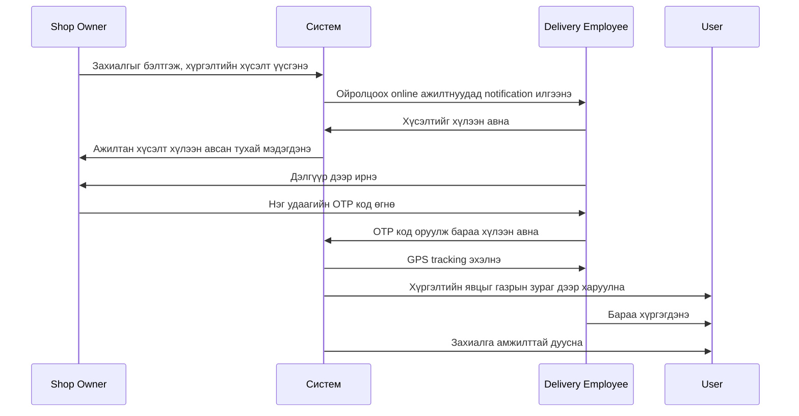

# 🚀 SaaS Хүргэлтийн Систем — Төслийн Шаардлага

> Дэлгүүрийн бараа захиалга, хүргэлтийн үйл ажиллагааг удирдах олон-хэрэглэгчийн SaaS платформ.

---

## 👥 Хэрэглэгчийн эрхүүд

| Эрх | Тайлбар |
|---|---|
| 🛡️ **Admin** | Системийн ерөнхий удирдлага |
| 🏪 **Shop Owner** | Subscription-тэй дэлгүүр эзэмшигч |
| 🛵 **Delivery Employee** | Хүргэлтийн ажилтан |
| 👤 **User** | Бараа захиалагч хэрэглэгч |

---

## 📑 Агуулга

1. [Нүүр хуудас](#1--нүүр-хуудас)
2. [Admin хэсэг](#2--admin-хэсэг)
3. [Shop Owner хэсэг](#3--shop-owner-хэсэг)
4. [Delivery Employee хэсэг](#4--delivery-employee-хэсэг)
5. [Хүргэлтийн хүсэлтийн ажиллагаа](#5--хүргэлтийн-хүсэлтийн-ажиллагаа)
6. [User хэсэг](#6--user-хэсэг)
7. [User-д харагдах хүргэлтийн төлөв](#7--user-д-харагдах-хүргэлтийн-төлөв)
8. [Notification](#8--notification)
9. [Байршлын мэдээлэл](#9--байршлын-мэдээлэл)

---

## 1. 🏠 Нүүр хуудас

Системийн нүүр хуудас дараах хэсгүүдтэй байна:

- 📢 Платформын танилцуулга
- ⚙️ Үйлчилгээний боломжууд
- 📘 Хэрхэн ажиллах заавар
- 💳 Subscription багцууд
- 🔑 Shop Owner нэвтрэх, бүртгүүлэх
- 🔑 Delivery Employee нэвтрэх, бүртгүүлэх
- ☎️ Холбоо барих мэдээлэл

> **Тэмдэглэл:** Shop Owner нь subscription төлбөр төлсний дараа дэлгүүрийн эрхээ идэвхжүүлж, системд нэвтрэн ажиллана.

---

## 2. 🛡️ Admin хэсэг

Admin нь тусдаа **хяналтын самбар (dashboard)** болон **sidebar цэстэй** байна.

### Admin-ийн үйлдлүүд

- [ ] Shop Owner-уудыг харах, нэмэх, засах, түдгэлзүүлэх
- [ ] Delivery Employee-үүдийг хянах
- [ ] User-үүдийг удирдах
- [ ] Subscription багц үүсгэх, засах, устгах
- [ ] Subscription төлбөрүүдийг хянах
- [ ] Дэлгүүрүүдийг идэвхжүүлэх, түдгэлзүүлэх
- [ ] Захиалга болон хүргэлтийн мэдээллийг хянах
- [ ] Маргаан, гомдлыг шийдвэрлэх
- [ ] Системийн тайлан харах
- [ ] Audit log буюу үйлдлийн түүхийг хянах
- [ ] Үндсэн CRUD үйлдлүүдийг гүйцэтгэх

---

## 3. 🏪 Shop Owner хэсэг

Shop Owner subscription эрхтэйгээр систем ашиглана.

### Дэлгүүрийн удирдлага
- [ ] Дэлгүүрийн мэдээллээ удирдах
- [ ] Дэлгүүрийн байршлыг газрын зурагт бүртгэх
- [ ] Бараа нэмэх, засах, устгах
- [ ] Барааны үнэ болон үлдэгдэл удирдах

### Захиалга ба хүргэлт
- [ ] Хэрэглэгчийн захиалгыг хүлээн авах
- [ ] Захиалгыг хүргэлтэд бэлтгэх
- [ ] Хүргэлтийн дуудлага үүсгэх
- [ ] Хүргэлтийн ажилтан сонгох эсвэл ойролцоох ажилтнуудад хүсэлт илгээх
- [ ] Хүргэлтийн ажилтан хүсэлтийг хүлээн авсан эсэхийг харах
- [ ] Ажилтан дэлгүүрт ирснийг баталгаажуулах
- [ ] Нэг удаагийн **OTP код**-оор бараа хүлээлгэн өгөх
- [ ] Хүргэлтийн явцыг хянах
- [ ] Захиалгын түүх болон тайлан харах

> 💡 **Ижил төстэй систем:** Хүргэлтийн дуудлага нь **UBCab**-тай төстэй ажиллана. Shop Owner хүргэлтийн хүсэлт үүсгэхэд ойр орчимд байгаа, онлайн төлөвтэй ажилтнуудад notification очно.

---

## 4. 🛵 Delivery Employee хэсэг

### 📝 Бүртгэлийн үе шат

Delivery Employee нь эхлээд нүүр хуудаснаас бүртгүүлнэ:

1. 🪪 ДАН системээр иргэний мэдээллээ баталгаажуулах
2. 🤳 Face ID буюу нүүр баталгаажуулалт хийх
3. 📞 Утас, email болон бусад шаардлагатай мэдээллээ бүртгэх
4. 📍 Байршил ашиглах зөвшөөрөл өгөх

Баталгаажуулалт амжилттай болсны дараа ажилтан системд нэвтэрнэ.

### 🔄 Ажилтны төлөв

| Төлөв | Утга |
|---|---|
| 🟢 **Online** | Хүргэлтийн хүсэлт хүлээн авах боломжтой |
| ⚪ **Offline** | Ажлаас буусан, хүсэлт хүлээн авахгүй |

> ⚠️ Зөвхөн **Online** төлөвтэй, баталгаажсан ажилтан хүргэлтийн хүсэлт хүлээн авах боломжтой.

### ⚙️ Үндсэн боломжууд

- [ ] Online/Offline төлөвөө өөрчлөх
- [ ] Одоогийн байршлаа системд дамжуулах
- [ ] Газрын зураг дээр ойролцоох дэлгүүрүүдийг харах
- [ ] Ойр орчимд үүссэн хүргэлтийн хүсэлтүүдийг харах
- [ ] Хүсэлтийг хүлээн авах
- [ ] Хүсэлтийг үл хэрэгсэх
- [ ] Shop хүртэлх зай болон маршрутыг харах
- [ ] Shop-д ирснээ мэдэгдэх
- [ ] OTP кодоор бараа хүлээн авах
- [ ] Хүргэлтийг эхлүүлэх
- [ ] Хэрэглэгчийн хүргэлтийн хаягийг харах
- [ ] Хүргэлтийг амжилттай дуусгах
- [ ] Өөрийн хүргэлтийн түүх болон орлогыг харах

> 🔒 Нэг хүргэлтийн хүсэлтийг нэг ажилтан хүлээн авсан тохиолдолд бусад ажилтанд тухайн хүсэлт **дахин харагдахгүй**.

---

## 5. 🔁 Хүргэлтийн хүсэлтийн ажиллагаа



**Дараалал (текстээр):**

1. Shop Owner захиалгыг хүргэлтэд бэлтгэнэ
2. Shop Owner хүргэлтийн хүсэлт үүсгэнэ
3. Систем дэлгүүрийн ойролцоох онлайн ажилтнуудыг олно
4. Тэдгээр ажилтанд notification илгээнэ
5. Ажилтан хүсэлтийг хүлээн авах эсвэл үл хэрэгсэх боломжтой
6. Эхэлж хүлээн авсан ажилтанд хүргэлт оноогдоно
7. Shop Owner-д ажилтан хүсэлтийг хүлээн авсан тухай мэдэгдэл очно
8. Ажилтан дэлгүүр дээр ирнэ
9. Shop Owner нэг удаагийн OTP код үүсгэнэ
10. Ажилтан OTP кодыг оруулж бараа хүлээн авна
11. Бараа хүргэлтэд гарч, ажилтны GPS tracking эхэлнэ
12. Хэрэглэгч хүргэлтийн явцыг газрын зураг дээр хянана
13. Бараа хүргэгдсэний дараа захиалга амжилттай дуусна

---

## 6. 👤 User хэсэг

- [ ] Бүртгүүлэх, нэвтрэх
- [ ] Дэлгүүр болон бараа харах
- [ ] Бараа захиалах
- [ ] Хүргэлтийн хаяг оруулах
- [ ] Захиалгын мэдээлэл харах
- [ ] Захиалгын төлөвийг үе шат бүрээр хянах
- [ ] Хүргэлтэд гарсан ажилтны байршлыг газрын зураг дээр харах
- [ ] Хүргэлтийн ажилтны үндсэн мэдээллийг харах
- [ ] Notification хүлээн авах
- [ ] Бараагаа хүлээн авснаа баталгаажуулах

---

## 7. 📦 User-д харагдах хүргэлтийн төлөв

```
✅ Захиалга баталгаажсан
     ↓
📦 Захиалгыг бэлтгэж байна
     ↓
🛵 Хүргэлтийн ажилтан томилогдсон
     ↓
🚚 Захиалга хүргэлтэд гарсан
     ↓
📍 Хүргэлтийн ажилтан ойртож байна
     ↓
🎉 Захиалга амжилттай хүргэгдсэн
```

> Захиалга хүргэлтэд гарсны дараа хэрэглэгч ажилтны **одоогийн байршлыг** газрын зураг дээр хянах боломжтой.

---

## 8. 🔔 Notification

Notification дараах тохиолдлуудад илгээгдэнэ:

| # | Үйл явдал |
|---|---|
| 1 | Шинэ хүргэлтийн хүсэлт үүсэх |
| 2 | Ажилтан хүсэлтийг хүлээн авах |
| 3 | Ажилтан дэлгүүрт ирэх |
| 4 | OTP код үүсэх |
| 5 | Бараа хүргэлтэд гарах |
| 6 | Ажилтан хэрэглэгчид ойртох |
| 7 | Бараа амжилттай хүргэгдэх |
| 8 | Хүргэлт цуцлагдах эсвэл амжилтгүй болох |

> 🛠️ **Хэрэгжүүлэлт:** Эхний хувилбарт **Web Notification** хэлбэрээр хэрэгжүүлж, дараа нь **SMS** болон **Push Notification** нэмэх боломжтой.

---

## 9. 📍 Байршлын мэдээлэл

- 🏪 Shop бүр газрын зураг дээр бүртгэлтэй координаттай байна
- 📡 Online ажилтны байршлыг `watchPosition()` ашиглан шинэчилнэ
- ⛔ Offline ажилтны байршлыг хянахгүй
- 🔄 Идэвхтэй хүргэлтийн үед байршлын мэдээллийг тогтмол шинэчилнэ
- 👤 User зөвхөн **өөрийн захиалгыг** хүргэж байгаа ажилтны байршлыг харна
- 🏪 Shop Owner зөвхөн **өөрийн дэлгүүрийн** хүргэлтүүдийг харна
- 🔐 Байршлын мэдээллийг **зөвшөөрөлтэйгөөр** цуглуулна
- 🛑 Хүргэлт дуусмагц тухайн захиалгын **live tracking зогсоно**

---

<p align="center"><sub>📄 Auto-formatted requirements document</sub></p>
